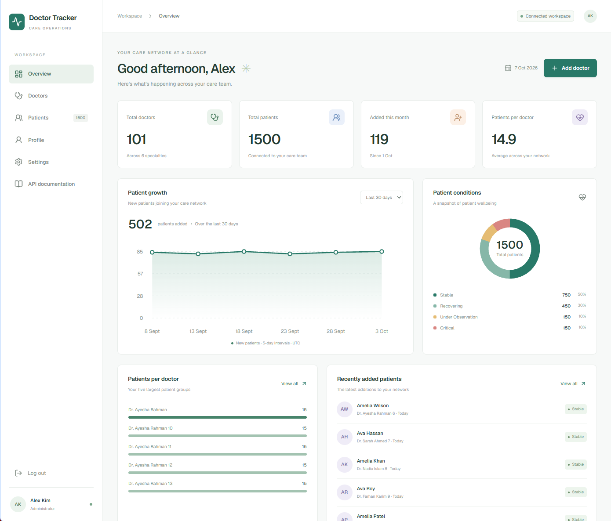
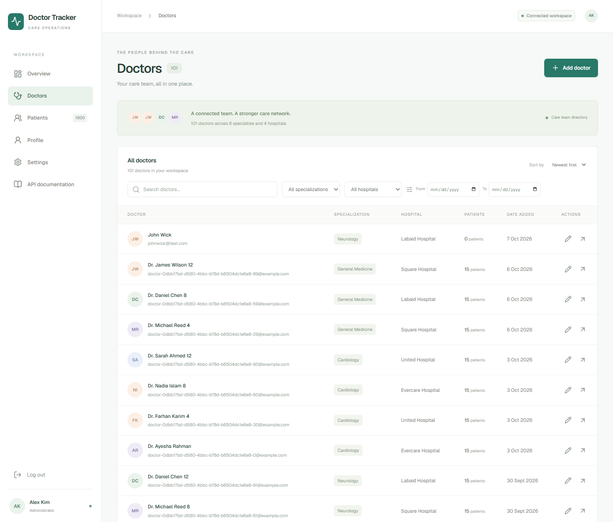
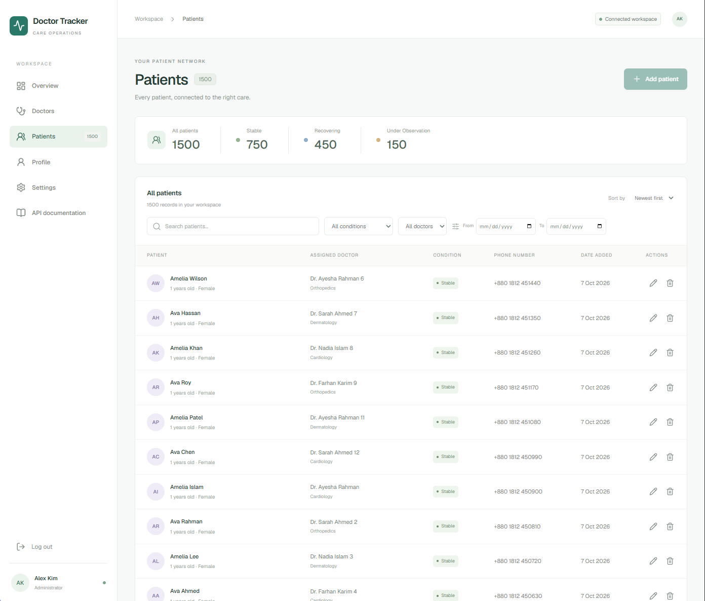
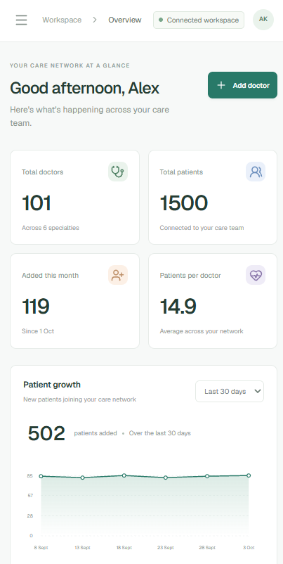
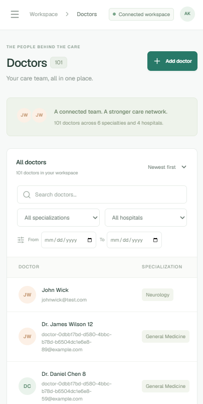
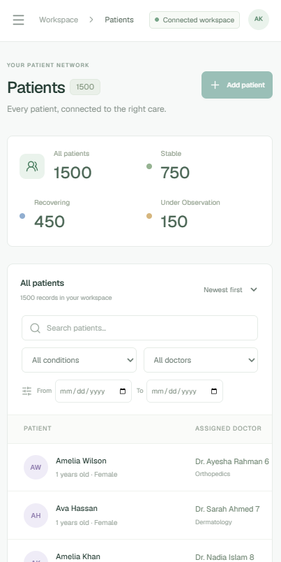

# Doctor Tracker Frontend

## Description

Doctor Tracker is a responsive care-management workspace for doctors, patients, and analytics. Built with Next.js, it provides secure access, searchable and paginated directories, patient management, and dashboard visualizations. This independent frontend communicates with a standalone Express REST API; MongoDB stores records and login sessions on the backend.

## Live links

| Resource                  | URL                                                                                  |
| ------------------------- | ------------------------------------------------------------------------------------ |
| Frontend application      | [Doctor Tracker](https://doctor-tracker-frontend-ten.vercel.app)                     |
| Frontend login            | [Sign in](https://doctor-tracker-frontend-ten.vercel.app/login)                      |
| Backend API documentation | [Swagger UI](https://doctor-tracker-backend-xi.vercel.app/docs/)                     |
| Backend health check      | [Health](https://doctor-tracker-backend-xi.vercel.app/health)                        |
| OpenAPI specification     | [OpenAPI JSON](https://doctor-tracker-backend-xi.vercel.app/openapi.json)            |
| Frontend repository       | [doctor-tracker-frontend](https://github.com/WorkWithAfridi/doctor-tracker-frontend) |
| Backend repository        | [doctor-tracker-backend](https://github.com/WorkWithAfridi/doctor-tracker-backend)   |

Reviewer login credentials are shared privately.

## Technology stack

| Area           | Technology                                                               |
| -------------- | ------------------------------------------------------------------------ |
| Framework      | Next.js 16 App Router, React 19, TypeScript                              |
| Interface      | Custom CSS, reusable React components, Lucide icons                      |
| Charts         | Accessible SVG charts using backend analytics                            |
| State and data | React external-store subscriptions, shared API cache, URL-backed filters |
| Authentication | Server-verified HTTP-only cookie sessions                                |
| Tooling        | ESLint, Prettier, TypeScript, Node test runner, tsx                      |
| Deployment     | Vercel                                                                   |

## Features

- Login, protected pages, logout, session restoration, and session-expiry handling.
- Doctor creation and editing with name, specialization, hospital, phone, and email.
- Doctor search, specialization/hospital/date filters, sorting, and pagination.
- Doctor profiles with assigned patients; patient creation, editing, reassignment, and confirmed deletion.
- Global patient search, condition/doctor/date filters, sorting, and pagination.
- Dashboard totals, patient growth, condition breakdown, doctor workload, and recent patients.
- Profile with password changes; administrator-only staff creation and workspace account listing.
- Administrator-only Settings for sample data generation and confirmed care-record reset.
- Responsive navigation, keyboard-accessible dialogs, loading/empty/error states, retry actions, and reduced-motion support.
- A sidebar link to interactive API documentation.

## Setup guide

### Prerequisites

Install Node.js 24 LTS, npm, and Git. Start the backend and MongoDB by following the [backend local setup guide](https://github.com/WorkWithAfridi/doctor-tracker-backend#local-setup). This frontend installs and builds independently; a running backend is required for login and application data.

### 1. Clone and install

```powershell
git clone https://github.com/WorkWithAfridi/doctor-tracker-frontend.git
cd doctor-tracker-frontend
npm.cmd ci
Copy-Item .env.example .env.local
```

Commands use Windows PowerShell. On macOS/Linux, use `npm` instead of `npm.cmd` and `cp .env.example .env.local` to copy the environment file.

### 2. Configure the API

Set this value in `.env.local` for a backend running locally:

```dotenv
NEXT_PUBLIC_API_URL=http://localhost:5000/api
```

The backend must allow the frontend origin through `FRONTEND_URL=http://localhost:3000`. Use `localhost` consistently when opening both applications. Restart the frontend after changing environment values.

`NEXT_PUBLIC_API_URL` is the upstream backend URL used by the Next.js rewrite and documentation links. Browser requests use the frontend's own `/api` path, which forwards requests and session cookies to the backend. Database credentials and passwords do not belong in frontend environment variables.

### 3. Start the application

```powershell
npm.cmd run dev
```

Open [Doctor Tracker locally](http://localhost:3000) and sign in with the administrator account configured during backend seeding. Staff accounts can be created by an administrator from Profile. The frontend has no public signup or fallback demo data.

### Scripts

| Command                 | Purpose                                   |
| ----------------------- | ----------------------------------------- |
| `npm.cmd run dev`       | Start the development server              |
| `npm.cmd run lint`      | Run ESLint                                |
| `npm.cmd run typecheck` | Check TypeScript types                    |
| `npm.cmd test`          | Run frontend API and cache tests          |
| `npm.cmd run build`     | Create a production build                 |
| `npm.cmd start`         | Serve the production build after building |
| `npm.cmd run format`    | Format source, tests, and README          |

## System architecture

```text
Browser -> Next.js frontend /api proxy -> Express REST API -> MongoDB
```

The protected layout verifies the session before rendering care-management pages. The backend owns authentication, authorization, validation, records, pagination, and analytics. The frontend owns presentation, forms, navigation, and resource subscriptions.

Successful writes invalidate cached resources so lists, profiles, selectors, and dashboard counts refresh together. Logout and session expiry clear cached records. Authentication tokens are not stored in browser storage; HTTP-only cookies carry the session. Swagger uses a separate session on the backend origin.

```text
src/
  app/          Pages, protected layout, and global styles
  components/   Layout, forms, tables, charts, dialogs, and feature views
  hooks/        API subscriptions and URL list filters
  lib/          API client and shared helpers
  services/     Authentication, record requests, and resource cache
  types/        Domain entities and response contracts
next.config.ts  Same-origin API rewrite and Next.js configuration
```

## Technical decisions

### 1. Shared API resources with React external-store subscriptions

A shared cache keyed by API path keeps lists, sidebar counts, and forms consistent after writes. `useSyncExternalStore` subscribes views to resource state, while the cache deduplicates in-flight requests and prevents aborted or superseded responses from replacing newer data. Feature components keep UI state, such as open dialogs, separate from server-owned records.

This avoids adding a state-management or query library for the project's current scope. The tradeoffs are maintaining the custom cache, broad invalidation after writes, and no automatic background polling or offline persistence. A larger application could use a query library with selective invalidation and cache eviction.

### 2. URL-backed queries with server pagination and analytics

Search, filters, sorting, and pagination live in the URL, preserving the current view through navigation and refresh. A 300 ms search debounce limits request churn. The request mapper converts UI query keys into API parameters, and tables render one server page instead of downloading every patient.

Dashboard charts visualize backend totals, condition counts, workloads, and UTC daily growth. The frontend groups daily counts into six display intervals without independently calculating database totals. Doctor assignment selectors load successive bounded pages so every doctor remains selectable; at larger scales, a remote searchable selector would reduce loading. Offset pagination suits the assessment dataset but would need cursor pagination for larger collections.

## Authentication and roles

Administrators and staff can manage doctors and patients, view analytics, and change their own password. Password changes require the current password and sign the user out on every device. Only administrators can create staff accounts and access Settings; these permissions are also enforced by the backend.

Settings population appends fictional doctors and patients. Reset requires confirmation and removes care records while retaining accounts and sessions. All writes affect the connected database and persist across sessions.

## Testing

Frontend tests mock HTTP transport and cover same-origin requests, cookies, errors, session-expiry notifications, query mapping, nested patient writes, doctor assignment pagination, request deduplication, stale-response protection, retries, and cache clearing. They do not modify the application database. Backend integration tests cover persistence and server-side permissions separately.

## Deployment

Import this repository as a Next.js project on Vercel with root directory `./` and the default Next.js build/output settings. Configure `NEXT_PUBLIC_API_URL=https://doctor-tracker-backend-xi.vercel.app/api` before building, and set the backend's `FRONTEND_URL` to the exact deployed frontend origin.

The frontend proxies API requests through its own origin, allowing first-party HTTP-only session cookies with the separately deployed backend. Production cookies use HTTPS and Secure attributes. The frontend does not connect directly to MongoDB.

## Visual evidence

### Desktop dashboard

Workspace totals, patient growth and conditions, doctor workload, and recently added patients.



### Desktop doctor management

Doctor directory with search, specialization/hospital/date filters, patient counts, and editing actions.



### Desktop patient management

Patient overview and directory with search, condition/doctor/date filters, assigned doctors, and editing/deletion actions.



### Mobile dashboard

Responsive workspace totals and patient growth chart.



### Mobile doctor management

Doctor directory with stacked search and filter controls on a narrow screen.



### Mobile patient management

Patient summary cards, search and filters, and the patient directory on mobile.


